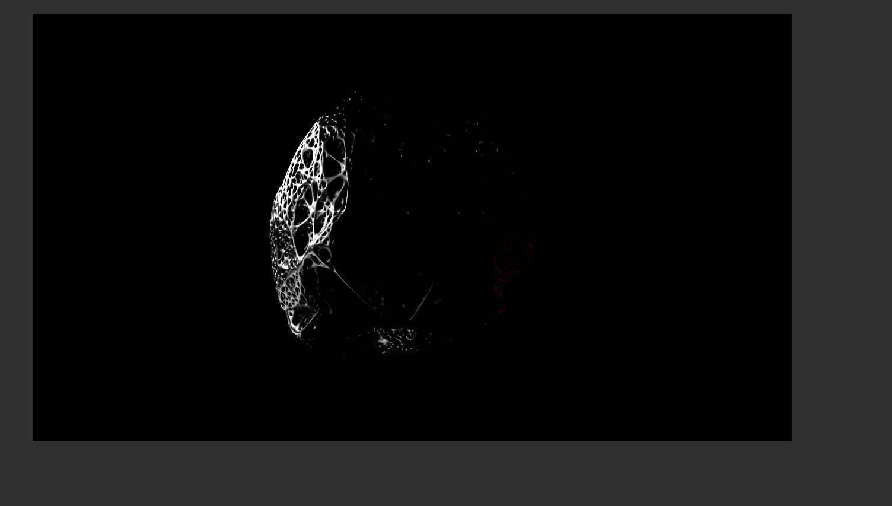
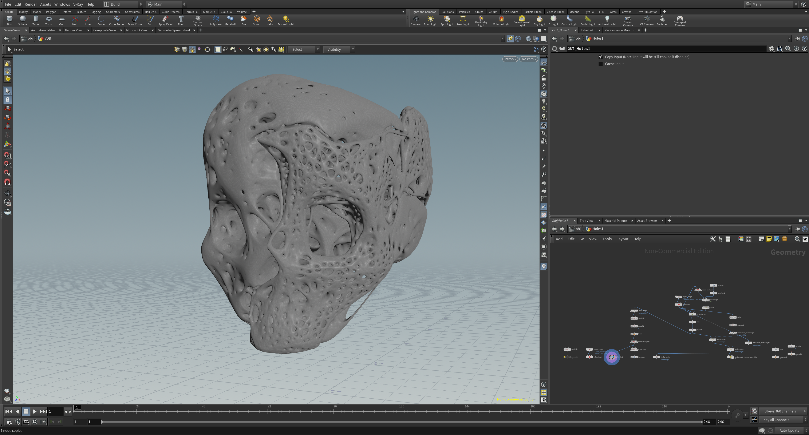
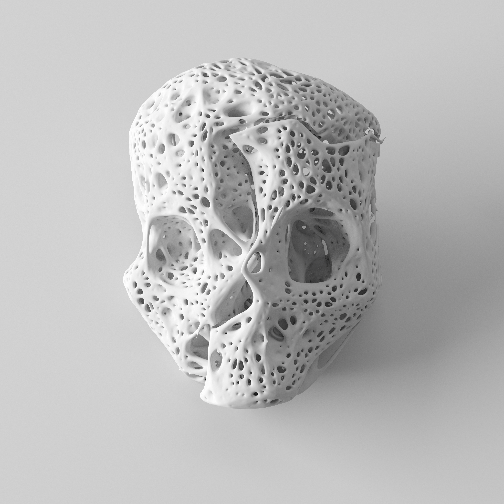
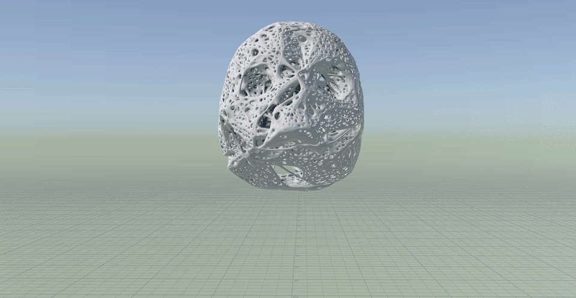
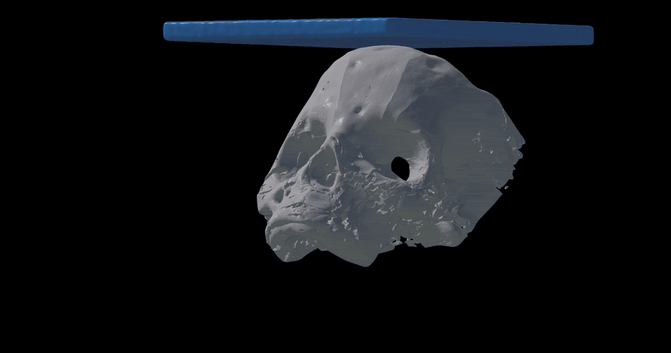
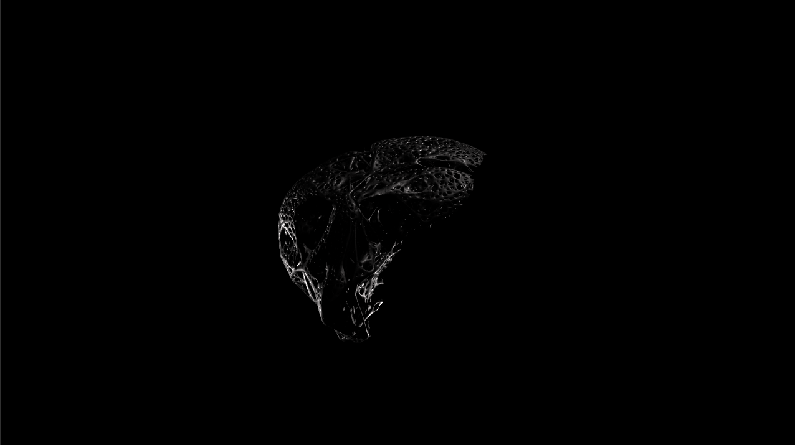
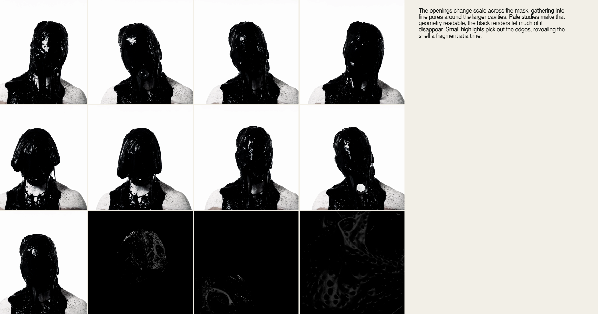
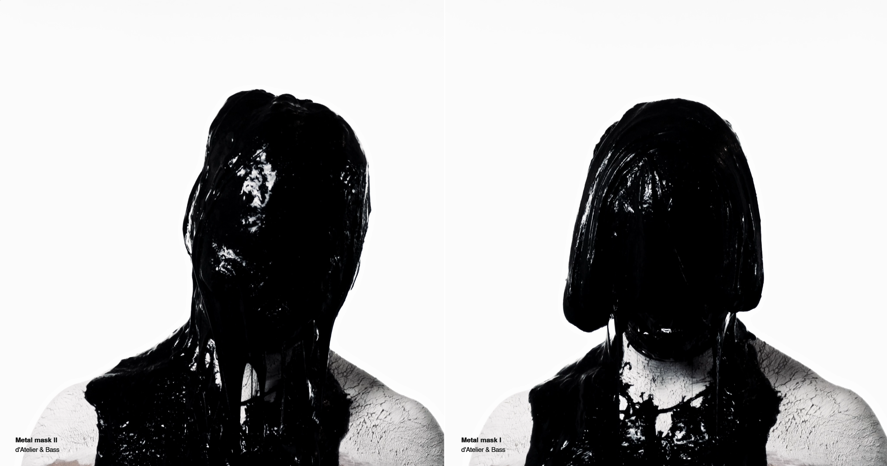
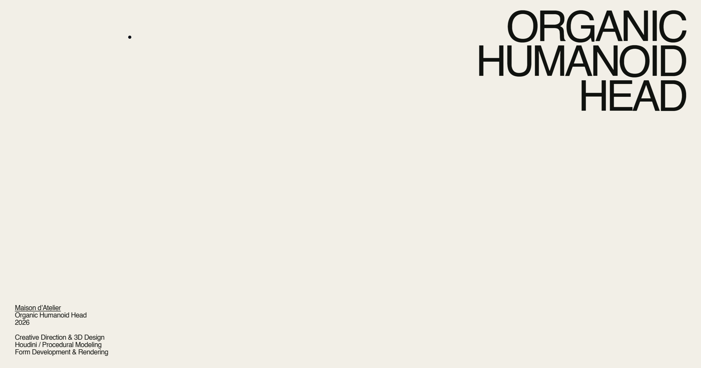
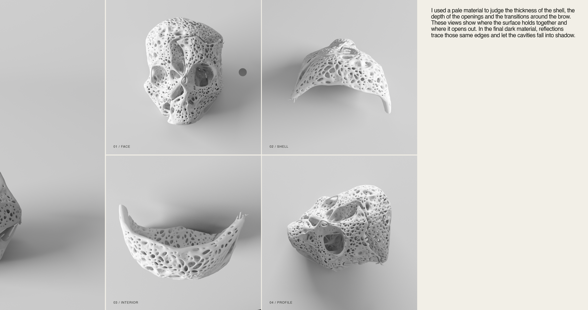

# Organic Humanoid Head / MetalMask

**Procedural modeling and fluid simulation in Houdini SideFX. Maison d’Atelier.**


The face is the anchor. Porous geometry and viscous motion can push it somewhere unfamiliar, as long as the portrait still holds your attention.

## References


<sub>Structural reference via <a href="https://i.pinimg.com/1200x/c7/33/46/c7334632abbf40ce4c7e9c8b8be9a52b.jpg" rel="nofollow">Pinterest</a>; original designer and publication unverified.</sub>

## Geometry and Lighting Tests


The modeling question is how far to open up the form before the face loses its presence.




The light does not need to explain the whole face. Keeping part of it unresolved gives the portrait its unease.

## 01 / Procedural Modeling in Houdini

A point wrangle for checking `creaseweight`, transcribed from the project capture:

```vex

@Cd.x = @creaseweight;

@Cd.y = 1-@creaseweight;

@Cd.z = 0;

```

Weights from 0 to 1 read as green through red. A quick viewport check before judging the surface.




Scattering, VDB operations and crease-weight transfers handle the form in Houdini. The art-direction call is where to keep structure and where to let it break open.

## 02 / Clay Renders



The portrait has to work in clay. Shading can add character, but the proportions need to carry it first.

<a href="docs/media-index.md#images">More geometric and clay views</a>

## 03 / Fluid Simulation in Houdini


The pause before the drip is the interesting part. Viscosity and contact determine how long that tension lasts.

<a href="media/video/coating-viscosity-2-8.mp4">Full coating clip</a> · <a href="media/video/viscous-mask.mp4">viscous mask</a> · <a href="media/video/driplets.mp4">driplets</a> · <a href="media/video/immersion.mp4">immersion</a>



<a href="media/video/metalmask-best.mp4">Coating study movie</a>



## 04 / Surface Tests

<a href="media/video/bubbles-closeup-1.mp4">Close-up 1</a> · <a href="media/video/bubbles-closeup-3.mp4">close-up 3</a>

## 05 / Simulation Playblasts

Viscosity, adhesion and vorticity, judged in playblast. At this stage, the motion needs to work without the help of lighting.

<a href="media/video/rough-viscosity-by-12.mp4">Viscosity by 12</a> · <a href="media/video/rough-adhesion-capture.mp4">adhesion capture</a> · <a href="media/video/rough-vorticity-droplets.mp4">vorticity / droplets</a> · <a href="media/video/rough-playbook-capture.mp4">rough playbook</a>

For the adhesion tests: <a href="media/video/adhesion-viewport-001.mp4">001</a>, <a href="media/video/adhesion-viewport-002.mp4">002</a>, <a href="media/video/adhesion-viewport-003.mp4">003</a>.

## 06 / Texturing and Lighting




A few sharp reflections are enough to bring the face forward. The dark material keeps the rest ambiguous, which is where the portrait gets its character.

<a href="media/video/final-organic-head.mp4">Final organic-head motion</a> · <a href="media/video/metalmask-portrait.mp4">MetalMask portrait motion</a>

## Files

[Media](docs/media-index.md) · [Source notes](docs/media-manifest.json) · [Archive details](docs/audit-notes.md)

---










