# Organic Humanoid Head / MetalMask

**Porous-shell construction, fluid interaction and material studies — Maison d’Atelier.**

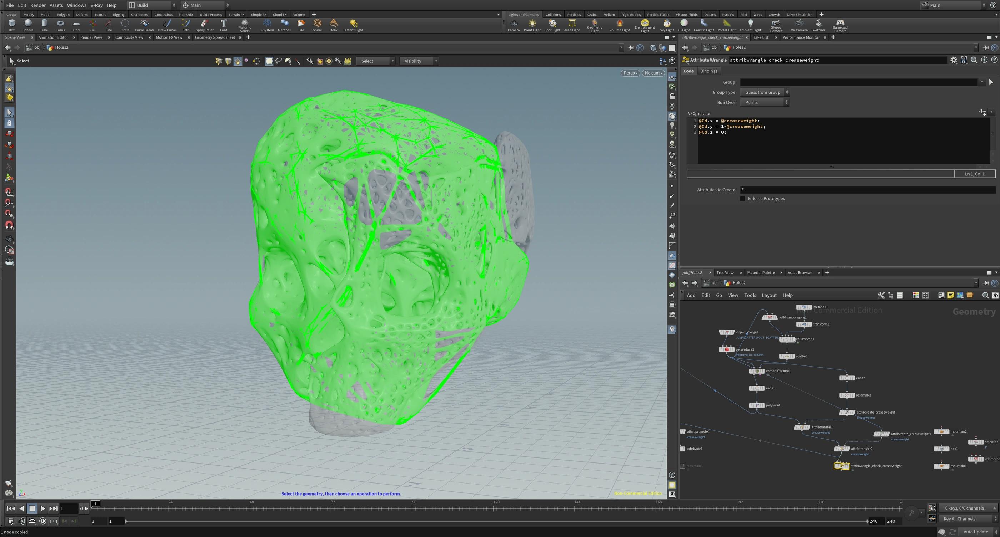

The central problem is to open a face into ribs and cavities without losing the brow, nose bridge and overall head. Pale geometry makes the construction readable; dark material lets it dissolve into reflections. This repository brings the overlapping Organic Humanoid Head and MetalMask material together as one project.

The evidence includes Houdini networks, clay views, liquid-contact experiments, rough viewport captures and finished motion. The site’s head asset mapping connects the newer named page to the earlier MetalMask imagery. Related liquid tests remain identified by their original source names in the [manifest](docs/media-manifest.json).

## Inspiration / bone-like structure

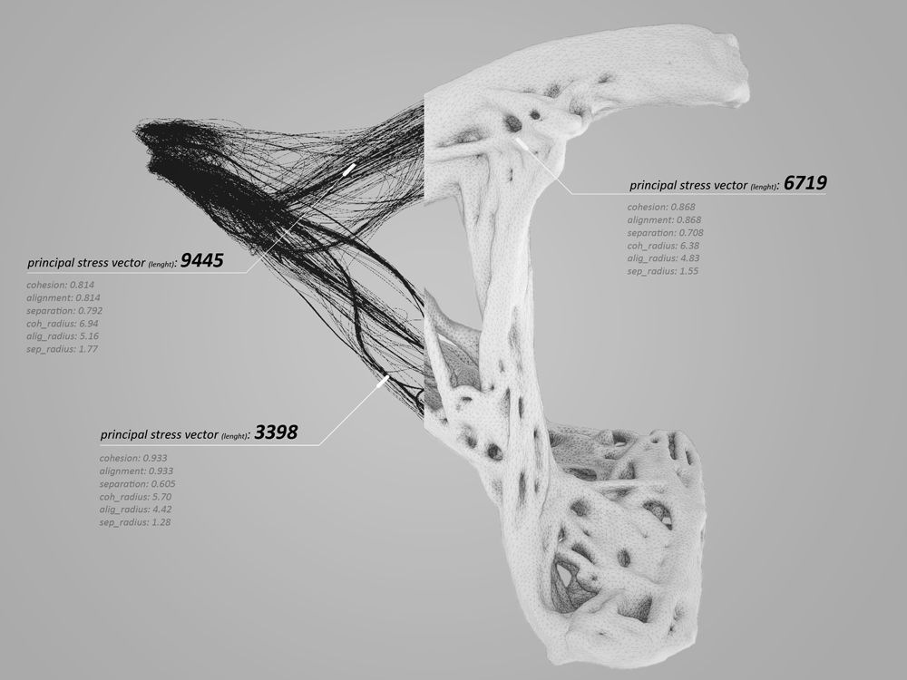

*Bone-like structural reference: thin connecting ribs, rounded cavities and denser bridges preserve a continuous form while opening its surface. The sheet pairs a dark strand diagram with a pale porous shell and labels principal stress vectors. Source: supplied file `c7334632abbf40ce4c7e9c8b8be9a52b.jpg`; original creator and publication remain unresolved.*

This is an inspiration for the head’s skeletal, porous construction, as identified by the artist. It is a diagram/render, not a photograph of a bone or a MetalMask result. Its labels do not establish that the head used the same structural-analysis or growth method. [Reference provenance](docs/references.md).

## Earlier construction and lighting studies

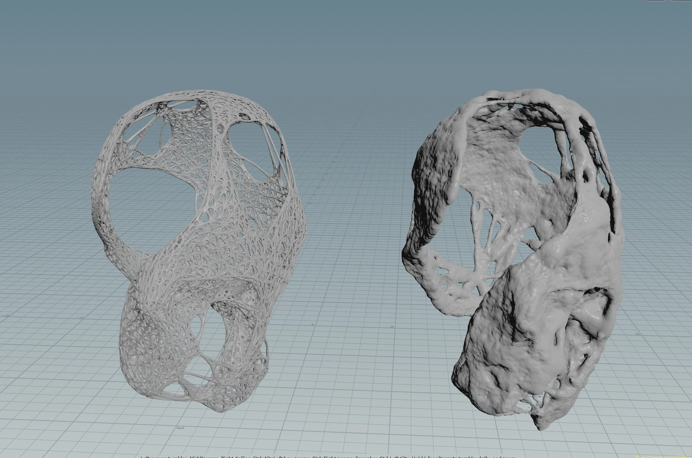
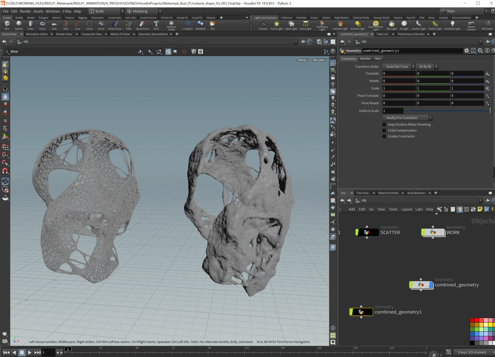
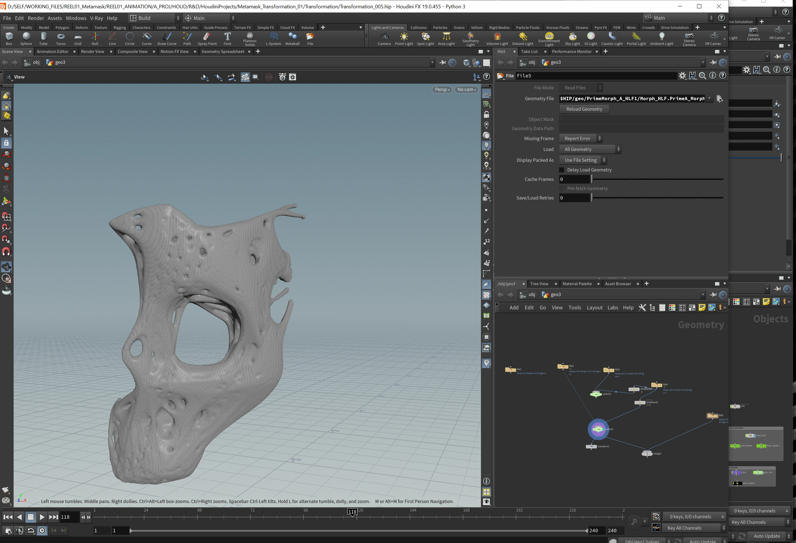

The added captures reveal a more open rib structure beside a denser surface treatment. The large eye opening and thin connections are exposed before the later fine-pore studies. The Houdini screenshots preserve the working context; the images support a comparison of construction states, without proving that one was generated directly from the other.

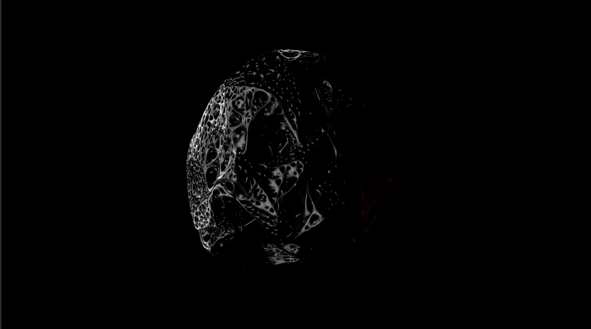

The two dark tests make only a fragment of the ribs visible. They show the tension carried into the final treatment: enough highlight to recognize the structure, enough shadow to conceal it.

## 01 / Building a shell that still reads as a face

The selected wrangle displays `creaseweight` through red/green point color. That diagnostic makes the attribute distribution visible alongside the shell instead of judging only a shaded result.

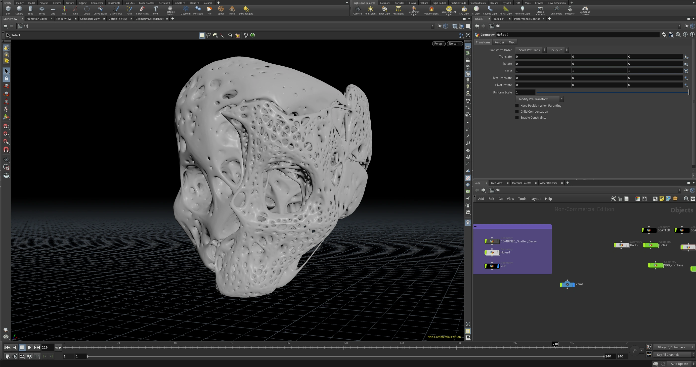

The object-level assembly retains separate `Holes`, `SCATTER` and VDB-related objects. The visible challenge is the transition between broad facial structure and fine openings: a cavity can be attractive locally while weakening the head’s silhouette as a whole.

## 02 / Checking depth, thickness and openings

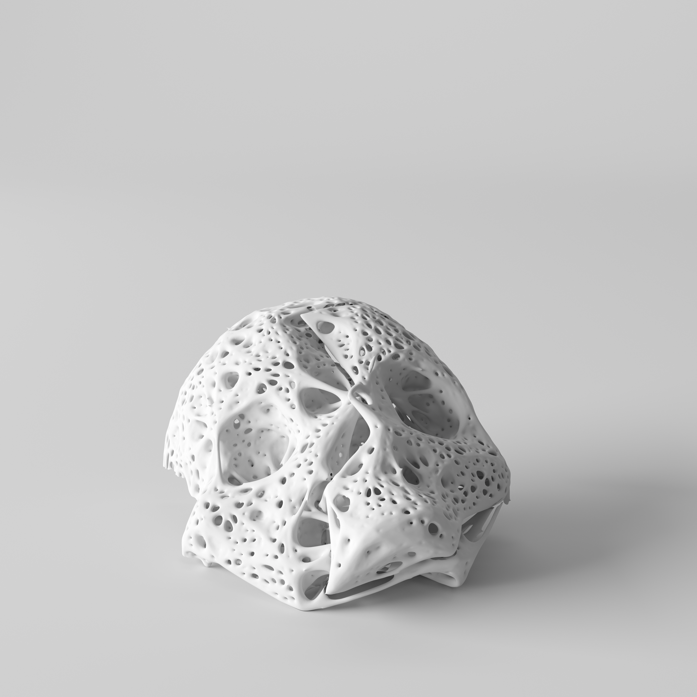

The front view checks facial readability. The pale material makes this judgment possible before black reflections conceal much of the surface.

[More geometric and clay views](docs/media-index.md#images)

## 03 / Liquid coating as a separate diagnostic

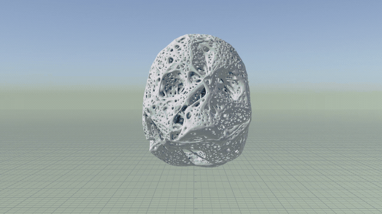

The blue fluid distinguishes the moving layer from the porous collider. In the coating study, streams join over the upper shell and extend into long drips. This makes coverage, bridging across holes and remaining facial detail directly comparable.

[Full coating clip](media/video/coating-viscosity-2-8.mp4) · [viscous mask](media/video/viscous-mask.mp4) · [driplets](media/video/driplets.mp4) · [immersion](media/video/immersion.mp4)

The coating sequence already had a matching 136-frame movie. That movie was compressed for delivery; no second movie was generated from its JPG frames.

## 04 / Adhesion and viscosity alternatives

[004c](media/video/adhesion-004c.mp4) · [004d](media/video/adhesion-004d.mp4) · [004e](media/video/adhesion-004e.mp4)

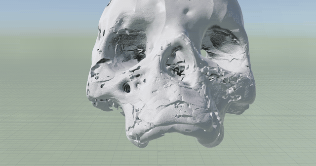

[Mercury viscosity 1](media/video/mercury-viscosity-1.mp4) · [alternative 2](media/video/mercury-viscosity-2-alt.mp4) · [random viscosity 2–8](media/video/random-viscosity-2-8.mp4) · [viscosity 2–4](media/video/viscosity-2-4.mp4) · [transition test](media/video/random-viscosity-transition.mp4)

## 05 / Close views and surface change

[Close-up 1](media/video/bubbles-closeup-1.mp4) · [close-up 3](media/video/bubbles-closeup-3.mp4)

## 06 / Rough captures and limits of review

These `.pic` sequences were recovered with Houdini’s image converter. Much of the head sits outside the right edge and the grid dominates the frame. They preserve an imperfect review setup: useful evidence that the process was not only polished shots, but insufficient for judging the whole liquid surface.

[Viscosity by 12](media/video/rough-viscosity-by-12.mp4) · [adhesion capture](media/video/rough-adhesion-capture.mp4) · [vorticity / droplets](media/video/rough-vorticity-droplets.mp4) · [rough playbook](media/video/rough-playbook-capture.mp4)

For clearer raw viewport comparisons: [adhesion 001](media/video/adhesion-viewport-001.mp4), [002](media/video/adhesion-viewport-002.mp4), [003](media/video/adhesion-viewport-003.mp4).

## 07 / From construction to final image

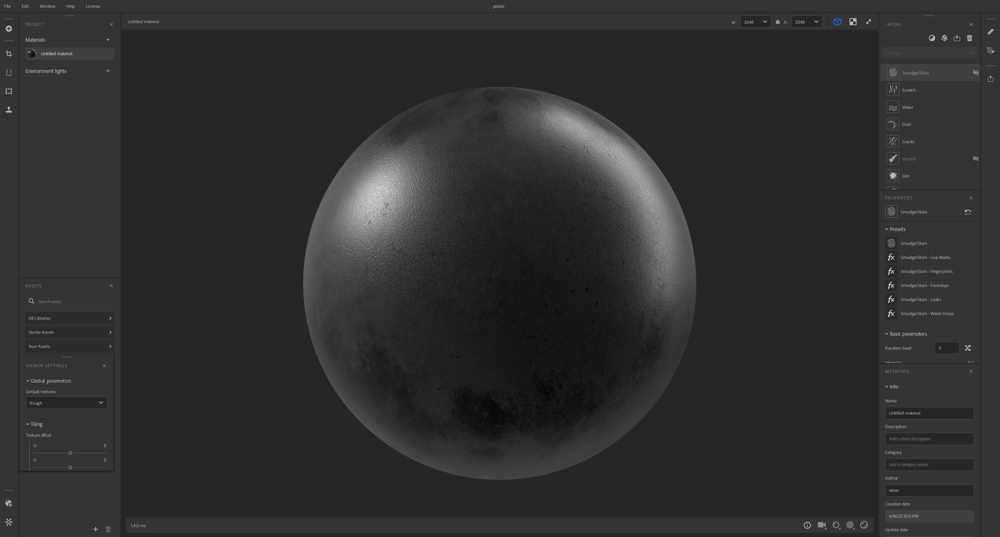

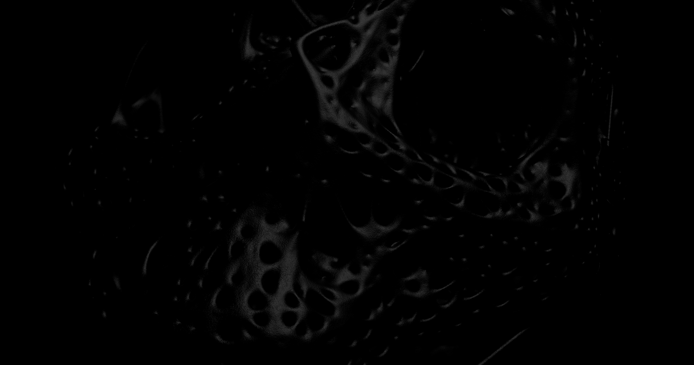
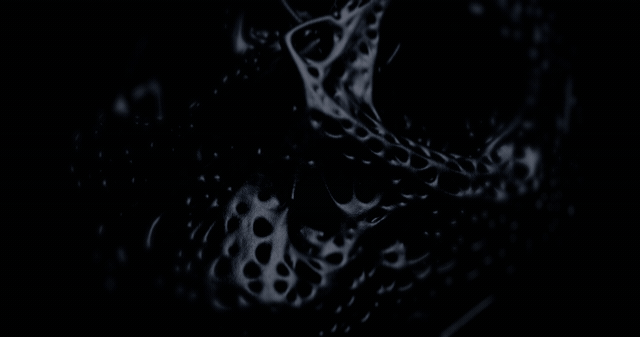

The dark render carries the same cavities and connecting ribs with small highlights. It is deliberately less explicit than the clay studies: geometry that was inspected openly during development becomes partially concealed in the final image.

[Final organic-head motion](media/video/final-organic-head.mp4) · [MetalMask portrait motion](media/video/metalmask-portrait.mp4)

The portrait clip records the related dense, glossy surface treatment shown on the MetalMask page. It is a companion presentation, not evidence that the porous-shell mesh generated that portrait.

## Archive notes

- [Complete media index](docs/media-index.md) · [source and processing manifest](docs/media-manifest.json) · [audit notes](docs/audit-notes.md)
- New numbered-sequence reviews use 24 fps, inferred from adjacent project playblasts. Original movie frame rates, including 25 fps adhesion clips, are retained.
- GIFs are preview excerpts; MP4s preserve the full selected clips. The chronology is organized by technical question rather than pretending file timestamps reconstruct production history.

---

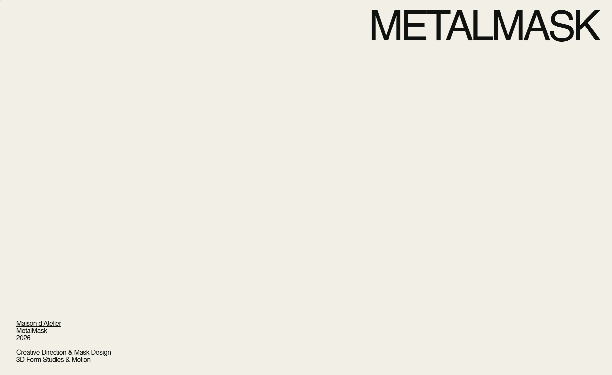

